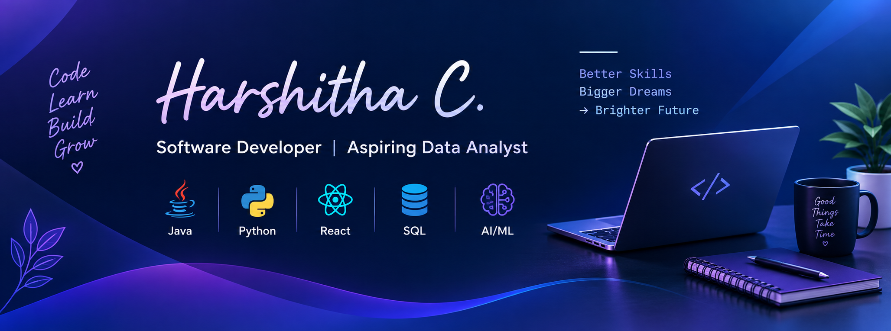

  

# Hi 👋, I'm Harshitha C.

### Software Developer | Java • Spring Boot • React • REST APIs • MySQL

I'm a Software Developer focused on building practical web applications, backend services, and REST APIs.

I work primarily with Java, Spring Boot, React, SQL, and modern web technologies. I enjoy building applications, integrating frontend and backend systems, debugging issues, and continuously improving my software engineering skills.

🌐 **Portfolio:** [View My Portfolio](https://harshitha-portfolio-fawn.vercel.app)

---

## 👩‍💻 About Me

- 💻 Building applications with **Java, Spring Boot, React, and REST APIs**
- 🌐 Interested in **Backend and Full-Stack Development**
- 🗄️ Working with **MySQL, MongoDB, and H2**
- 🔐 Working with **Spring Security and OAuth 2.0**
- 🛠️ Using **Git, GitHub, Maven, Docker, and Postman**
- 📊 Interested in **SQL, Python, Data Analytics, Excel, and Power BI**
- 🤖 Exploring **AI/ML and intelligent applications**
- 🚀 Building practical projects focused on real-world use cases
- 📚 Continuously learning and improving my technical skills

---

## 🛠️ Technical Skills

### Languages
`Java` `SQL` `JavaScript` `Python`

### Backend
`Spring Boot` `Spring MVC` `Spring Security` `JDBC` `FastAPI` `REST APIs`

### Frontend
`React` `HTML` `CSS` `Bootstrap`

### Databases
`MySQL` `MongoDB` `H2`

### Tools
`Git` `GitHub` `Docker` `Maven` `Postman` `VS Code` `Eclipse` `MySQL Workbench`

### Data & Analytics
`SQL` `Python` `Data Analysis` `Excel` `Power BI`

### Currently Exploring
`AI/ML` `Generative AI` `LLM Applications` `TypeScript` `Cloud Technologies`

---

## 💼 Experience

### Freelance Full Stack Developer
**Pre-Startup Client · Remote · 2025**

- Developed approximately 70% of an e-commerce web application using Java, Spring Boot, React, REST APIs, and MySQL.
- Built product catalog, shopping cart, checkout, user account, and order management features.
- Implemented Admin and Customer roles with role-based access control.
- Worked directly with the client on requirements, development, API integration, debugging, and assigned scope delivery.

### Software Developer Intern
**Sigvitas & Company · Mysore · Oct 2024 – Dec 2024**

- Worked on a Patent Search & Clustering application.
- Contributed to frontend and backend integration across multiple application modules.
- Worked with REST APIs and supported frontend-backend integration.
- Fixed cross-browser UI issues and assisted with application debugging.

---

# 🚀 Featured Projects

## ⭐ StaffHub — Employee Management System

A full-stack employee management application with role-based workflows for Admin, HR, and Employees.

**Tech:** Java, Spring Boot, Spring Security, Spring Data JPA, H2, JavaScript

### Highlights

- Admin, HR, and Employee dashboards
- Employee management
- Attendance tracking
- Leave management
- Task management
- Payroll and payslip features
- Department management
- Announcements
- Role-based access control

🔗 **Live Demo:** [Open StaffHub](https://staffhub-employee-management.onrender.com)

🔗 **Source Code:** [GitHub Repository](https://github.com/Harshitha0501/staffhub-employee-management)

---

## 🔹 Salesforce CRUD Application

A full-stack Salesforce integration application built with React and FastAPI.

**Tech:** React, FastAPI, Salesforce API, OAuth 2.0

### Highlights

- Salesforce OAuth 2.0 authentication
- CRUD operations
- Account management
- Opportunity management
- Lead management
- Contact management
- Case management
- Pagination and validation

🔗 **Source Code:** [GitHub Repository](https://github.com/Harshitha0501/sf-crud-app)

---

## 🔹 SkillGap AI

A career-focused application that compares skills against selected job roles and provides a personalized skill improvement roadmap.

**Tech:** React, FastAPI, MongoDB, JavaScript

### Highlights

- Job-role matching
- Skill gap identification
- Career roadmap
- Interview preparation
- Progress tracking
- Rule-based skill scoring

🔗 **Live Demo:** [Open SkillGap AI](https://skillgap-ai-mu.vercel.app)

🔗 **Source Code:** [GitHub Repository](https://github.com/Harshitha0501/skillgap-ai)

---

## 🔹 URL Shortener

A backend-focused URL shortening application built with Java and Spring Boot.

**Tech:** Java, Spring Boot, MySQL, Docker, REST APIs

### Highlights

- URL shortening
- REST API development
- MySQL database integration
- Dockerized application setup
- Backend service development

🔗 **Source Code:** [GitHub Repository](https://github.com/Harshitha0501/url-shortener)

---

## 📊 Data Analytics Project

### Swiggy Restaurant Data Analysis

Analyzed **81,777 restaurant records** using MySQL to explore restaurant locations, cuisine categories, ratings, pricing patterns, and cost-versus-rating relationships.

**Tech:** MySQL • SQL • Data Cleaning • Data Analysis

🔗 **Source Code:** [GitHub Repository](https://github.com/Harshitha0501/Swiggy-SQL-Analysis)

---

## 📜 Certifications

### HackerRank — Software Engineer

[View Certificate](https://www.hackerrank.com/certificates/iframe/9a6b4d2791a5)

### HackerRank — SQL Intermediate

[View Certificate](https://www.hackerrank.com/certificates/iframe/1cbdb84dd236)

---

## 🎯 Currently Learning

- Advanced Java & Spring Boot
- Full-Stack Development
- REST API Development
- SQL & Data Analytics
- Python
- AI/ML Applications
- Generative AI & LLM Applications
- Cloud Technologies

---

## 🤝 Connect With Me

🌐 **Portfolio:** [harshitha-portfolio-fawn.vercel.app](https://harshitha-portfolio-fawn.vercel.app)

💼 **LinkedIn:** [linkedin.com/in/harshitha-c2605](https://linkedin.com/in/harshitha-c2605)

🐙 **GitHub:** [github.com/Harshitha0501](https://github.com/Harshitha0501)

📧 **Email:** [harshithac0512@gmail.com](mailto:harshithac0512@gmail.com)

---

## 🛠️ Languages & Tools

  

### 📊 Data & AI

  
  
  
  

---

## 📈 GitHub Activity

Explore my repositories and projects:

---

---

## 🌍 Open Source Contributions

### ✅ Developer Portfolios — Merged

- **Contribution:** Added my developer portfolio to the open-source community repository.
- **Pull Request:** [#4308 — Add Harshitha C portfolio](https://github.com/emmabostian/developer-portfolios/pull/4308)
- **Status:** Successfully merged into `master`.

### 🔄 Kestra — In Progress

- **Contribution:** Replacing Bootstrap spacing utility classes with scoped CSS.
- **Pull Request:** [#20621 — Replace spacing utility classes in TimeSelect](https://github.com/kestra-io/kestra/pull/20621)
- **Status:** Open — awaiting review.

### 🚀 Build • Learn • Improve
